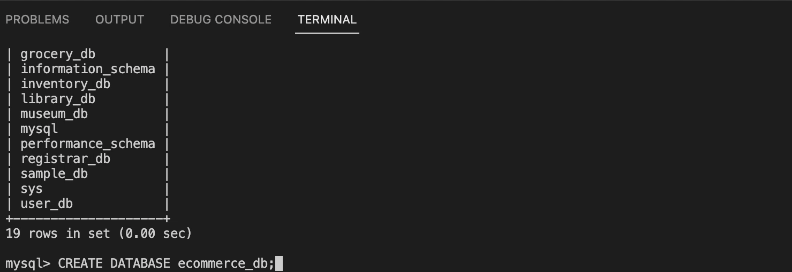
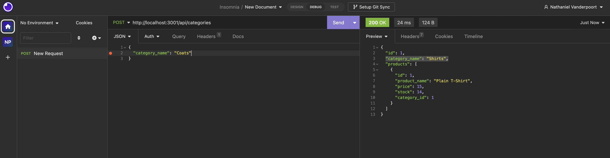

# Nathaniel-ORM-E-Commerce
## Description
#
This is a backend e-commerce site that allows the user to create a database with categories, products, prices, and stock.

## Installation 
#
This app was created using javascript and these npm packages: dotenv, sequelize, mysql2, express, express-session, and connect-session-sequelize.
## Usage
#
The user begins by using mysql in the command line. From there they are able to drop any pre-existing databases or create a new one - in this case the ecommerce databse. After creating the database the user exits out of mysql and uses the command npm run seed. Then, sequelize takes all of the information from the seeds and populates the objects into each of the files in the models folder. After sequelize has synced all of the information , the server is turned on. From there the user is able to run different routes in Insomnia. 

## Credits
#
Credit goes to UCI for providing the develop folder starter code. 

## License
#
N/A
## Deployment 
(https://drive.google.com/file/d/1E4iaYFAQhRMbAFsVGYl-pjkt1sr1TTId/view?usp=sharing)

